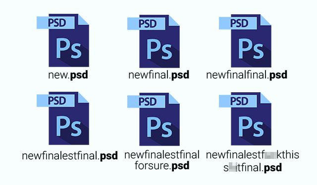
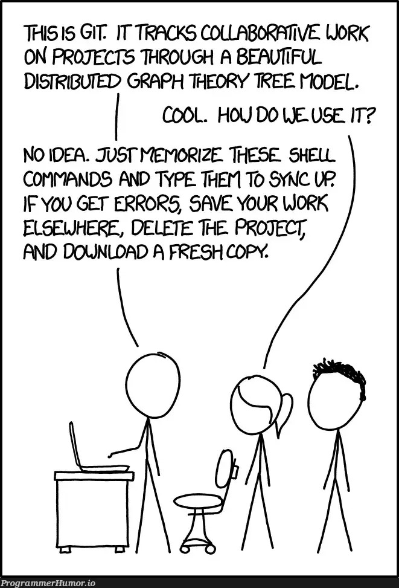

# Git

<!-- incremental_lists: true -->
<!-- pause -->

- Version control system
<!-- pause -->

<!-- pause -->

- Generally only adds data, most actions are reversible

<!--end_slide-->

# Version Control Demo

<!-- incremental_lists: true -->

- `git init`
- `git status`
- `git add`
- `git commit`
- `x2`
- `git checkout`

<!--end_slide-->

# Git Stages

<!-- incremental_lists: true -->

- Untracked: not being tracked by git
- Staged: being tracked by git, detects modification
- Committed: saved to git's database
<!--end_slide-->

<!--end_slide-->
